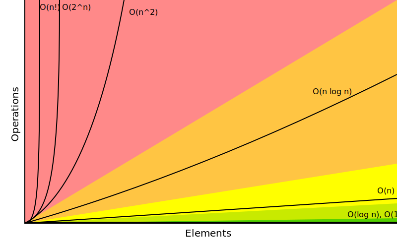

# Algorithm Lab

A Deno + TypeScript playground for exploring algorithmic complexity, performance
characteristics, and type-safe API design.

## Getting started

```sh
deno task start
```

An interactive CLI lets you select which algorithms to benchmark, set iteration
counts, and view results in a live-updating table.

## Complexity notation

All time and space complexities are expressed using Big O notation.



## Algorithms

### Search

| Algorithm     | Complexity | Notes                                         |
| ------------- | ---------- | --------------------------------------------- |
| Linear search | O(n)       | Works on any array                            |
| Binary search | O(log n)   | Requires `SortedArray<T>` (enforced by types) |
| Native search | O(n)       | Delegates to `Array.findIndex`                |

### Sort

| Algorithm      | Complexity | Stable | Mutates |
| -------------- | ---------- | ------ | ------- |
| Native sort    | O(n log n) | Yes    | No*     |
| Merge sort     | O(n log n) | Yes    | No      |
| Insertion sort | O(n²)      | Yes    | No      |
| Selection sort | O(n²)      | No     | No      |

_\*Wraps `Array.sort` (TimSort in V8) but copies the input first to avoid
mutation._

## Benchmark setup

- Multiple dataset sizes per category (search: 10K–1M, sort: 1K–50K).
- JIT warmup phase before measurement.
- Per-iteration timing via `performance.now()` with min/avg/max reporting.
- Randomized input for sort, worst-case (last element) for search.

## TypeScript design focus

This project uses TypeScript as a design and modeling tool:

- **Branded types** — `SortedArray<T>` and `Index` encode domain invariants at
  the type level, making illegal states unrepresentable.
- **Generic algorithm interfaces** — `SearchAlgorithm<T, A>` and
  `SortAlgorithm<T>` define contracts that all implementations conform to.
- **Factory functions** — each algorithm is a factory returning an interface
  implementation, keeping instantiation uniform.
